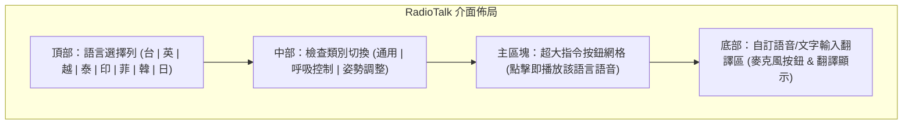

# 放射師專用多國語音輔助系統 (RadioTalk) — 應用程式提案與規劃

這份文件記錄了為放射師設計的「多國語音溝通輔助應用程式」的創意構想、功能需求與技術可行性評估，以便未來進行開發。

---

## 1. 核心定位與痛點分析

### 放射科溝通痛點
1. **時間緊迫性**：放射檢查（如 X 光、CT、MRI）通常有嚴格的時間限制，且檢查當下需要病患精確配合（例如「吸氣、憋氣」）。溝通不順會直接影響影像品質與檢查效率。
2. **環境阻隔**：放射師通常位於控制室，與檢查室內病患隔著鉛玻璃與麥克風，病患可能因為機器運轉噪音聽不清指令。
3. **語言障礙**：
   - 台灣本地長者：習慣使用**台語**。
   - 外籍勞工與看護：以**印尼文、越南文、菲律賓話、泰文**為主。
   - 國外旅客：**英文、日文、韓文**。

### 解決方案：RadioTalk
一個專為放射師設計的**快速點擊、即時發音、離線可用**的語音翻譯輔助 Web App / 行動應用程式。

---

## 2. 系統架構與功能規劃

### A. 常用指令快選區 (Preset Commands) — **核心功能**
由於放射檢查指令高度標準化，**點擊預設按鈕播放語音**是最快速、最實用的方式（避免放射師每次都要手動輸入或語音辨識）。

*   **檢查分類分頁**：
    *   **通用指令**：「請進來」、「請躺下」、「請不要動」、「檢查結束了，辛苦了」。
    *   **呼吸控制（最關鍵）**：「請吸氣，憋住氣」、「可以吸氣了（吐氣）」、「請深呼吸」。
    *   **姿勢調整**：「請轉身側躺」、「請雙手抱頭抬高」、「請將下巴抬高」。
*   **快速切換目標語言**：畫面上有一排國旗/語言按鈕（台、英、越、泰、印、菲、韓、日），點擊後，整頁的預設按鈕立刻切換為該語言，點擊按鈕直接播放對應語音。

### B. 自訂輸入翻譯 (Custom Translation) — **輔助功能**
當遇到預設指令無法解決的狀況時使用。
*   **輸入方式**：支援**繁體中文語音輸入**（免打字）或文字輸入。
*   **輸出方式**：將中文即時翻譯為目標語言，並以 TTS (Text-to-Speech) 播放，同時顯示大字體文字給病患看。

### C. 支援語系一覽表
| 語言 | 應用場景 | 翻譯技術 | 語音輸出 (TTS) 策略 |
| :--- | :--- | :--- | :--- |
| **繁體中文** | 放射師輸入語系 | - | - |
| **台語 (Min Nan)** | 本地長者 | 預錄語音 (常用指令) | 常用指令預錄語音（因一般 TTS 對台語支援度較差） |
| **英語 (English)** | 國際通用 | 翻譯 API / 預設對照 | Web Speech API 或 雲端 TTS |
| **越南文 (Vietnamese)**| 外籍病患/看護 | 翻譯 API / 預設對照 | Web Speech API 或 雲端 TTS |
| **泰文 (Thai)** | 外籍病患 | 翻譯 API / 預設對照 | Web Speech API 或 雲端 TTS |
| **印尼文 (Indonesian)**| 外籍病患/看護 | 翻譯 API / 預設對照 | Web Speech API 或 雲端 TTS |
| **菲律賓話 (Tagalog)**| 外籍病患 | 翻譯 API / 預設對照 | Web Speech API 或 雲端 TTS |
| **韓文 (Korean)** | 國外旅客 | 翻譯 API / 預設對照 | Web Speech API 或 雲端 TTS |
| **日文 (Japanese)** | 國外旅客 | 翻譯 API / 預設對照 | Web Speech API 或 雲端 TTS |

---

## 3. 技術可行性與挑戰評估

### 挑戰 1：台語語音的準確度
*   **問題**：Google Translation 或 Web Speech API 目前不支援高品質的台語語音輸出（TTS），或是腔調不夠道地。
*   **解決方案**：
    1.  **預錄真人語音**：針對 20-30 個最常用的放射科指令，請台語流利的人士預先錄製高品質音檔（`.mp3`/`.wav`）。這是最穩定、最道地且支援離線播放的作法。
    2.  **串接台灣在地 TTS**：如教育部或工研院研發的台語 TTS API（需聯網）。

### 挑戰 2：醫院放射室內網路訊號弱 (Shielding)
*   **問題**：X 光室與 CT/MRI 室通常有鉛板或銅網屏蔽，Wi-Fi 或行動網路訊號可能極差，導致即時翻譯 API 失敗。
*   **解決方案 (Offline-First)**：
    *   採用 **PWA (Progressive Web App)** 技術，將常用指令的各國語言翻譯與語音檔（台語預錄音檔、其他語言的預設文字）快取在瀏覽器中（Cache Storage）。
    *   其他支援 Web Speech API 離線語音包的語言（如英、日、韓，在 iOS/Android 上通常內建離線語音），可直接在本地端進行語音合成播放，實現**完全離線運作**。

---

## 4. UI/UX 介面設計構想

為了符合放射科的使用情境，介面設計應遵循：
1.  **高對比與暗色模式 (Dark Mode)**：放射科控制室通常光線昏暗，便於看診斷螢幕。暗色底、亮色字（如科技感深藍搭配發光綠/青色）能保護放射師眼睛。
2.  **超大按鈕**：方便快速點擊，避免按錯。
3.  **直覺的呼吸指示動畫**：當播放「吸氣、憋氣」時，畫面上可同步顯示肺部擴張與停止的動畫，輔助聽力受損或聽不懂語言的病患（如果病患看得到螢幕的話）。

### 介面佈局示意

---

## 5. 未來開發規劃路徑 (Roadmap)

### 第一階段：MVP (最小可行性產品) - 單網頁 PWA
*   **目標**：先建立一個包含「呼吸控制」與「通用指令」的網頁。
*   **實作**：
    *   整理出放射科最常用 15 個指令，並翻譯成 8 種目標語言。
    *   尋找或預錄台語及其他語言的語音音檔。
    *   使用純 HTML/CSS/JS 建立一個適用於平板與手機的靜態網頁，點擊按鈕即播放對應音檔。
    *   加入 PWA 設定，讓放射師可以將網頁「安裝」到平板或手機桌面上，離線也能使用。

### 第二階段：加入 AI 翻譯與 TTS 整合
*   **目標**：支援臨時自訂句子的語音輸入與即時翻譯。
*   **實作**：
    *   串接 **Gemini API** 進行繁體中文到 8 國語言的翻譯（特別是針對醫學指令的優化）。
    *   整合 Web Speech API 進行瀏覽器端 TTS 播放，或串接 TTS 雲端服務。

### 第三階段：院內部署與優化
*   **目標**：推廣至科室使用，並根據實際反饋調整。
*   **實作**：
    *   新增自訂指令功能（放射師可自行新增常用字句）。
    *   支援語音合成速度調整（部分年長或緊張病患需要更慢的語速）。

---
*這份構想已儲存於您的工作區。當您準備好要開始編寫程式碼時，請隨時通知我，我們可以從**第一階段的 MVP 靜態原型**開始建構！*
